# vyre

Part of [Santh](https://santh.dev) - open source Rust security and infrastructure tooling. Follow [@SanthProject](https://x.com/SanthProject) on X.

Vyre is a production-focused GPU compute stack for workloads that usually get
pulled back to the CPU: parsing, graph traversal, fixed-point dataflow,
rule evaluation, and other coordination-heavy programs.

The project is still young. The core IR, spec contracts, CPU reference path,
CUDA path, WGPU path, PTX emitter, conformance crates, and primitive libraries
are active. Some frontends and future backends are intentionally marked beta or
planned below. The goal is to make that status obvious so contributors can pick
useful work without guessing what is production-ready.

For the `0.4.2` line, the public semantic unit is `vyre::Program`: programs are
constructed as IR, checked against frozen spec contracts, run through the CPU
reference oracle, then validated against GPU backends. CUDA is the primary
release path on NVIDIA systems; WGPU is the portable GPU fallback.

## Workspace architecture

```mermaid
flowchart TB
    classDef active fill:#0f766e,color:#fff,stroke:#045a55;
    classDef beta fill:#b45309,color:#fff,stroke:#78350f;
    classDef stub fill:#6b7280,color:#fff,stroke:#374151;
    classDef planned fill:#4b5563,color:#fff,stroke:#1f2937;

    subgraph S0["Tier-1 foundations"]
      Vcore["vyre-core\npublic facade + re-exports"]
      Fnd["vyre-foundation\nIR, validation, optimizer"]
      Spec["vyre-spec\ncontracts + schemas"]
      Macros["vyre-macros\nregistration helpers"]
      Intr["vyre-intrinsics\nhardware-facing intrinsic surface"]
    end

    subgraph S1["Tier-2.5/3 and reference"]
      Ref["vyre-reference\nCPU reference oracle"]
      Primitives["vyre-primitives\ngraph/matching/math/nn/hash/text/parse"]
      Libs["vyre-libs\ntier-3 composition surface"]
      SelfSS["vyre-self-substrate\nself-consumer + scheduler path"]
    end

    subgraph S2["Backend, lowering, and execution"]
      Drv["vyre-driver\nbackend traits + registry"]
      Cuda["vyre-driver-cuda\nrelease backend"]
      Wgpu["vyre-driver-wgpu\nportable GPU backend"]
      Spirv["vyre-driver-spirv\nSPIR-V surface"]
      Lower["vyre-lower\nIR shaping helpers"]
      EmitPtx["vyre-emit-ptx\nPTX + NVRTC"]
      EmitNaga["vyre-emit-naga\nWGSL/Naga"]
      EmitSpv["vyre-emit-spirv\nSPIR-V emitter"]
      RefDrv["vyre-driver-reference\nreference backend adapter"]
    end

    subgraph S3["Runtime + conformance + evidence"]
      RT["vyre-runtime\nmegakernel + io_uring"]
      Aot["vyre-aot\noffline packaging"]
      Hs["vyre-harness\nruntime harness"]
      Debug["vyre-debug\ntracing + inspection"]
      Bench["vyre-bench\nbenchmarks"]
      Lints["vyre-lints\npolicy checks"]
      Fuzz["fuzz\nfuzzing suites + mutation inputs"]
      XTask["xtask\nCI/audit matrix"]
      ConSpec["vyre-conform-spec\nprogram spec"]
      ConGen["vyre-conform-generate\ncase generation"]
      ConEnf["vyre-conform-enforce\nenforcement gates"]
      ConRun["vyre-conform-runner\nrunner + reporting"]
      TestHarness["vyre-test-harness\nshared fixtures"]
    end

    subgraph S4["Consumer-facing / experimental surfaces"]
      FC["vyre-frontend-c\nC frontend pipeline"]
      FR["vyre-frontend-rust\nRust frontend pipeline"]
      Ff["consumer-owned tools\nfuture frontend backends"]
      Intg["consumer examples\noutside Vyre"]
      MT["Metal backend\nplanned"]
      DX["DXIL/DirectX\nplanned"]
      WG["Wasm/WebGPU\nplanned"]
    end

    Vcore --> Spec
    Fnd --> Spec
    Intr --> Fnd
    Primitives --> Libs
    Libs --> SelfSS
    Libs --> ConRun
    Vcore --> Drv
    Ref --> ConRun

    Drv --> Cuda
    Drv --> Wgpu
    Drv --> Spirv
    Cuda --> RT
    Wgpu --> RT
    Spirv --> RT
    RefDrv --> RT
    Lower --> EmitPtx
    Lower --> EmitNaga
    Lower --> EmitSpv
    EmitPtx --> RT
    EmitNaga --> RT
    EmitSpv --> RT

    RT --> Hs
    RT --> Aot
    RT --> Debug
    RT --> Bench
    ConSpec --> ConRun
    ConGen --> ConRun
    ConEnf --> ConRun
    TestHarness --> ConRun
    Fuzz --> XTask
    XTask --> ConRun
    XTask --> Lints
    ConRun --> Bench
    ConEnf --> Bench
    Aot --> RT
    XTask --> Bench

    FC --> Libs
    FC --> RT
    FR --> Libs
    FR --> RT
    Ff --> FC
    Intg --> FC

    XTask -.-> MT
    XTask -.-> DX
    XTask -.-> WG

    class Vcore,Fnd,Spec,Macros,Intr,Ref,Primitives,Libs,SelfSS,Drv,Cuda,Wgpu,Spirv,Lower,EmitPtx,EmitNaga,EmitSpv,RefDrv,RT,Aot,Hs,Debug,Bench,Fuzz,Lints,XTask,ConSpec,ConGen,ConEnf,ConRun,TestHarness active
    class FC,FR,Ff beta
    class Intg stub
    class MT,DX,WG planned
```



The older SVG remains in [docs/architecture.svg](docs/architecture.svg), but
the diagram above is the README source of truth because it names every
workspace crate and release-support status and separates active, beta,
and planned/stubbed surfaces.

Legend:

- `active`: part of the normal release and supported in the current `0.4.2` train.
- `beta`: functional in repo but not yet on the release gate.
- `stub`: explicit placeholders for future consumer surfaces.
- `planned`: target architecture work not yet represented in code.

## The 10-second pitch

Most GPU frameworks make the simple parallel case comfortable. Vyre focuses on
the awkward cases: workloads with local state, branches, graph edges, parser
state, convergence loops, or rule-engine control flow. It tries to keep those
programs in IR long enough to test them against a reference implementation and
then run them on GPU without rewriting each workload as hand-authored kernels.

The core promise is practical: compose ops, run the reference path, run the
GPU backend, and keep the two results aligned where the contract requires
exactness.

Vyre is not a replacement for CUDA, WGPU, SPIR-V, or domain-specific compilers.
It is a contract layer above them. It is also not finished. The most
contributions right now are concrete: smaller modules, better conformance
coverage, CUDA parity tests, frontend bug fixes, benchmark cases that represent
real workloads, and docs that make rough edges visible instead of hiding them.

## The vyre crates

| Crate | Status | Purpose |
|-------|--------|---------|
| `vyre` | active | Public facade over IR construction, lowering, and backend traits |
| `vyre-core` | active | Core user-facing crate published as `vyre` |
| `vyre-foundation` | active | IR, serialization, validation, transforms, optimizer substrate |
| `vyre-spec` | active/frozen | Data contracts, stable tags, schema types, operation metadata |
| `vyre-reference` | active | Pure-Rust CPU oracle used by parity and conformance tests |
| `vyre-driver` | active | Backend traits, registry, routing, lifecycle, diagnostics |
| `vyre-driver-cuda` | active/release path | CUDA backend for NVIDIA systems |
| `vyre-driver-wgpu` | active/fallback path | Portable GPU backend through WGPU |
| `vyre-driver-spirv` | active | SPIR-V backend surface for Vulkan-style runners |
| `vyre-driver-reference` | active | Thin backend wrapper around the reference interpreter |
| `vyre-intrinsics` | active | Hardware-mapped intrinsic operation contracts |
| `vyre-primitives` | active | Shared graph, text, hash, reduce, matching, math, parsing, fixpoint, and NN substrate |
| `vyre-libs` | active | Higher-level IR compositions built from intrinsics and primitives |
| `vyre-self-substrate` | active | Vyre using its own primitives for scheduling, graph, optimization, and coverage work |
| `vyre-runtime` | active/experimental | Persistent megakernel runtime and Linux `io_uring`/streaming integration |
| `vyre-aot` | active | Ahead-of-time packaging and artifact support |
| `vyre-harness` | active | Runtime harness utilities |
| `vyre-macros` | active | Proc-macros for pass and registration ergonomics |
| `vyre-lower` | active | Lowering helpers shared by emitter crates |
| `vyre-emit-ptx` | active/CUDA-focused | PTX emitter and NVRTC-backed validation tests |
| `vyre-emit-naga` | active | Naga/WGSL-oriented emitter path |
| `vyre-emit-spirv` | active | SPIR-V emitter path |
| `vyre-frontend-c` | beta | C frontend pipeline; useful for development, not clang parity |
| `vyre-frontend-rust` | beta | Rust frontend pipeline experiments |
| `vyre-bench` | active | Benchmark harnesses and workload evidence |
| `vyre-lints` | active | Project lint and policy checks |
| `vyre-debug` | active | Debugging and inspection helpers |
| `vyre-conform-spec` | active | Conformance specification crate |
| `vyre-conform-generate` | active | Conformance case generation |
| `vyre-conform-enforce` | active | Conformance enforcement gates |
| `vyre-conform-runner` | active | Backend conformance runner |
| `vyre-test-harness` | active | Test harness support used by conformance crates |
| `xtask` | active | Workspace task runner for release, audit, and policy checks |

Planned but not shipped as first-class workspace crates yet: native Metal,
DXIL/DirectX, and wasm/WebGPU packaging. They are roadmap targets, but they
are not support claims until real backend code, parity evidence, and CI gates
exist in the repository.

`vyre-frontend-c` and `vyre-frontend-rust` are intentionally beta because
parser and type-front end parity is still maturing. `conform` and
`vyre-test-harness` backpressure and corpus coverage are the primary reason they
are not release gates.

## `0.4.2` release execution contract

The release route is explicit: `0.4.2` is a Vyre platform release, not a
production C compiler release.

| Package | Version | Role |
| --- | --- | --- |
| `vyre@0.4.2` | `0.4.2` | Public IR, lowering, optimizer, and backend trait surface |
| `vyre-driver-cuda@0.4.2` | `0.4.2` | NVIDIA/CUDA fast path for release workloads |
| `vyre-driver-wgpu@0.4.2` | `0.4.2` | Portable GPU fallback path for non-CUDA systems |
| `dataflow-integration@0.0.1` | `0.0.1` | Dataflow and witness primitives over Vyre IR |

`vyrec` and `vyre-frontend-c` are beta/active-development consumers of Vyre.
They are included to show the intended compiler-front-end direction, but they
are not the release gate for `0.4.2`, are not advertised as clang-parity, and
must not be treated as production-ready C compiler components until their own
corpus, parity, and performance gates are green.

CUDA is the preferred release backend when an NVIDIA GPU is present. WGPU is a GPU fallback backend, not a CPU fallback. A failed CUDA or WGPU probe on a machine that should have a GPU is a configuration error surfaced to the caller with remediation context; it is never silently converted into CPU execution.

Release readiness is checked through backend metadata, feature matrices,
conformance reports, benchmark reports, and documentation checks generated by
the project tooling. C parser corpus reports are tracked as beta validation for
`vyrec`, not as a blocker for the Vyre platform release.

## The five-tier rule: where every op lives

vyre ops live at exactly one tier. The tier is encoded in the op ID
prefix and determines stability, size cap, and audit requirements.
Full rule in [`docs/library-tiers.md`](docs/library-tiers.md).

| Tier | Crate(s) | What lives here | Size cap |
| --- | --- | --- | --- |
| **1** | `vyre-foundation`, `vyre-spec`, `vyre-core` | IR model, wire format, frozen contracts. No ops. | - |
| **2** | `vyre-intrinsics` | Cat-C hardware-mapped intrinsics: ops that need a dedicated Naga emitter arm + dedicated `vyre-reference` eval arm (subgroup_*, barrier, fma, popcount, bit_reverse, inverse_sqrt). | frozen 9-op surface |
| **2.5** | `vyre-primitives` | Reusable LEGO substrate shared by multiple Tier-3 dialects: bitset, graph, reduce, predicate, fixpoint, text, matching, math, hash, parsing, nn. | Gate 1 budget |
| **3** | `vyre-libs` today; domain crates split only when they earn standalone ownership | Every product-facing `fn(...) -> Program` composition: math, hash, logical, nn, matching, rule, text, parsing, security. | no cap |
| **4** | External community crates | Tier-3-shaped packs outside the core org, registered via extension packs | no cap |

**Op ID tells you the tier**: `vyre-intrinsics::hardware::fma_f32` is T2,
`vyre-primitives::graph::reachable` is T2.5, `vyre-libs::hash::fnv1a32`
is T3, `<community-dialect>::foo` is T4.

**Dependency direction is enforced**: T2 depends on T1 only;
T2.5 depends on T1 plus narrowly-approved intrinsics; T3 depends on
T2.5+T2+T1; T4 depends on T3+T2.5+T2+T1. Never upward. CI gate
`cargo_full run --bin xtask -- check-tier-deps` rejects violations.

**Region chain invariant**: every op at every tier wraps its body
in `Node::Region` and, when built from another registered op,
populates `source_region` so `cargo_full run --bin xtask -- print-composition <op_id>`
can walk the decomposition chain from public surface down to hardware
intrinsics. Spec in [`docs/region-chain.md`](docs/region-chain.md).

**Frontends stay outside core**. vyre is a GPU IR; source-language
frontends live in Tier-3 crates or downstream tools, generate grammar
tables / packed AST buffers, and feed GPU-side ops that walk those
buffers. Full spec + throughput math in
[`docs/parsing-and-frontends.md`](docs/parsing-and-frontends.md).

## How to navigate the docs

Every significant surface in vyre has a canonical doc. When onboarding:

| You want | Read this |
| --- | --- |
| Architecture and layering | `docs/ARCHITECTURE.md`, `docs/THESIS.md`, `docs/VISION.md` |
| **Which tier does my op belong to?** | `docs/library-tiers.md` |
| **Composition chain: how ops stay auditable** | `docs/region-chain.md` |
| **Source parsers: where frontends live** | `docs/parsing-and-frontends.md` + **`docs/PARSING_EXECUTION_PLAN.md`** (phases, tests) |
| Documentation precedence | `docs/DOCUMENTATION_GOVERNANCE.md` |
| Current release gate | `audits/RELEASE_GATE.md` |
| Historical plans | `docs/V7_RELEASE_PLAN.md`, `.internals/audits/from-docs-audits/MASTER_PLAN*.md` |
| **Ops catalog: full release surface** | `docs/ops-catalog.md` |
| **Santh-wide Cat‑A building blocks + testing program (roadmap)** | `docs/OP_MASTER_PLAN_BUILDING_BLOCKS_AND_QA.md` |
| **Execution status + op inventory refresh** | `docs/EXECUTION_STATUS.md`, `docs/generated/OP_INVENTORY.md` |
| Writing a new op (contract + review checklist) | `docs/library-tiers.md` + `docs/region-chain.md`: **no raw WGSL ever; the whole contract is here** |
| Wire format + release tag reservations | `docs/wire-format.md` |
| Backend contract (capability queries, lifecycle hooks, sealing) | `vyre-driver/BACKEND_CONTRACT.md` |
| OpDef field audit (primitive / hardware / composite / tensor-core) | `vyre-spec/OPDEF_CONTRACT.md` |
| Frozen trait surfaces (5-year SemVer) | `docs/frozen-traits/*.md` |
| Memory model + ordering | `docs/memory-model.md` |
| Error-code catalog (stable u32 ids) | `docs/error-codes.md` |
| SemVer + API-stability policy | `docs/semver-policy.md` |
| Observability (tracing spans + stats schema) | `docs/observability.md` |
| Security disclosure + threat model | `SECURITY.md` + `docs/threat-model.md` |
| Release playbook (publish order, alpha soak) | `docs/RELEASE.md` |
| Design RFCs (Region inline, autodiff, quantization, collectives, megakernel) | `docs/rfcs/000*.md` |
| Persistent megakernel + `io_uring` NVMe streaming (Linux) | `vyre-runtime/README.md` |
| Testing standard + 6 category skills | `.internals/skills/testing/SKILL.md` |
| Per-crate test contract | `<crate>/tests/SKILL.md` |
| In-flight release-bar gap contracts | `contracts/release.md` |
| Benchmark baselines | `benches/RESULTS.md` + `docs/BENCHMARKS.md` |
| Public-API snapshots (diff gate) | `<crate>/PUBLIC_API.md` |

## Try it in 2 minutes

```sh
cargo add vyre vyre-reference vyre-driver-cuda vyre-driver-wgpu
```

Build a program, serialize it to text, and run the reference interpreter:

```rust
use vyre::ir::{BufferDecl, DataType, Expr, Node, Program};
use vyre_reference::{run, value::Value};

fn main() -> Result<(), Box<dyn std::error::Error>> {
    // Construct an IR program that XORs two u32 buffers element-wise.
    let program = Program::wrapped(
        vec![
            BufferDecl::read("a", 0, DataType::U32),
            BufferDecl::read("b", 1, DataType::U32),
            BufferDecl::read_write("out", 2, DataType::U32),
        ],
        [1, 1, 1],
        vec![
            Node::let_bind("idx", Expr::u32(0)),
            Node::store(
                "out",
                Expr::var("idx"),
                Expr::bitxor(
                    Expr::load("a", Expr::var("idx")),
                    Expr::load("b", Expr::var("idx")),
                ),
            ),
        ],
    );

    println!("{}", program.to_text()?);

    let inputs = &[
        Value::Bytes(vec![0xAA, 0x00, 0x00, 0x00].into()),
        Value::Bytes(vec![0x55, 0x00, 0x00, 0x00].into()),
        Value::Bytes(vec![0x00; 4].into()),
    ];
    let outputs = run(&program, inputs)?;
    println!("output: {:?}", outputs);
    Ok(())
}
```

Run the same program on a GPU through an explicit backend. CUDA is the `0.4.2` release fast path on NVIDIA systems; WGPU remains the portable fallback:

```rust
use vyre::VyreBackend;
use vyre_driver_cuda::CudaBackend;

fn dispatch_cuda(program: &vyre::ir::Program) -> Result<(), Box<dyn std::error::Error>> {
    let backend = CudaBackend::acquire().map_err(|error| {
        std::io::Error::other(format!(
            "CUDA backend acquisition failed. Fix: inspect nvidia-smi, CUDA driver setup, and device capability reporting; do not treat this as a CPU fallback: {error}"
        ))
    })?;
    let inputs: Vec<Vec<u8>> = vec![
        vec![0xAA, 0x00, 0x00, 0x00],
        vec![0x55, 0x00, 0x00, 0x00],
        vec![0x00; 4],
    ];
    let outputs = backend
        .dispatch(program, &inputs, &Default::default())
        .map_err(|error| {
            std::io::Error::other(format!(
                "CUDA dispatch failed. Fix: inspect PTX lowering, launch bounds, and backend/device configuration: {error}"
            ))
        })?;
    println!("output: {:?}", outputs);
    Ok(())
}
```

Use `vyre-driver-wgpu` when CUDA is not the target backend:

```rust
use vyre::VyreBackend;
use vyre_driver_wgpu::WgpuBackend;

fn dispatch_wgpu(program: &vyre::ir::Program) -> Result<(), Box<dyn std::error::Error>> {
    let backend = pollster::block_on(WgpuBackend::acquire()).map_err(|error| {
        std::io::Error::other(format!(
            "WGPU backend acquisition failed. Fix: inspect adapter enumeration and driver setup; do not treat this as a CPU fallback: {error}"
        ))
    })?;
    let inputs: &[&[u8]] = &[
        &[0xAA, 0x00, 0x00, 0x00],
        &[0x55, 0x00, 0x00, 0x00],
        &[0x00; 4],
    ];
    let outputs = backend
        .dispatch_borrowed(program, inputs, &Default::default())
        .map_err(|error| {
            std::io::Error::other(format!(
                "WGPU dispatch failed. Fix: inspect backend/device configuration: {error}"
            ))
        })?;
    println!("output: {:?}", outputs);
    Ok(())
}
```

The wire format provides lossless binary transport: `program.to_wire()` serializes, `Program::from_wire()` reconstructs, and round-trip equality is invariant I4. The former general-purpose bytecode VM and NFA-scan micro-interpreter are absent from the `0.4.2` release line: every detection primitive (string scanning, taint flow, AST motif, decode chain, binary structural, neural suspicion filter, exploit-graph reconstruction, …) composes from vyre ops. No legacy host micro-interpreter remains in core; the resident megakernel is the GPU execution path. A downstream detection engine can compose scan, taint, decode, parse, fixpoint, graph, and neural stages in vyre IR. See [docs/ARCHITECTURE.md](docs/ARCHITECTURE.md) for architecture, [docs/wire-format.md](docs/wire-format.md) for the wire format, and [docs/inventory-contract.md](docs/inventory-contract.md) for the extension model.

## Standard library

The Layer 1 primitives live in `vyre` (core) and are organized into domains:

- **Primitive ops**: bitwise, arithmetic, and logical operations with exhaustive edge-case coverage and algebraic law verification.
- **Byte/text scan ops**: Aho–Corasick, substring find-all, multi-way scanners with real WGSL kernels (one ingredient inside larger programs).
- **Workgroup coordination primitives**: stack, FIFO queue, priority queue, hashmap, state machine, typed arena, string interner, visitor walk, recursive descent, dataflow fixed-point, dominator tree, and union-find.
- **Compiler primitives**: DFA engines, parser combinators, dataflow solvers, and tree-walk abstractions composed from workgroup primitives.

Composition-inlineable helpers live inside `vyre`'s own `ops::` tree alongside their primitives:

- **DFA/regex compilation pipeline**: `regex_to_nfa` (Thompson) → `nfa_to_dfa` (subset construction) → `dfa_minimize` (Hopcroft) → `dfa_pack` (Dense or EquivClass) → `dfa_assemble` (composite entry).
- **Aho-Corasick construction**: CPU reference + WGSL kernel + 5 GOLDEN samples + 20 KAT vectors.
- **Content-addressed compilation cache**: skips the pipeline when the same pattern set has already been compiled.
- **Arithmetic helpers**: ~80 typed compositional ops (saturating, wrapping, clamp, lerp, midpoint, abs_diff, div_ceil/round/floor).

## Benchmarks

The benchmark story is moving toward compiler-grade macro workloads on CUDA,
not primitive element-wise crossover tables. Current benchmark snapshots cover
13 macro workload families on an RTX 5090 with CUDA 12.8, using repeated
wall-time and CPU-baseline samples per artifact.

| workload family | case | input floor | measured CUDA speedup vs CPU-SOTA |
|---|---|---:|---:|
| condition eval | `release.condition_eval.1m` | 12,582,916 bytes | 12,981.60x |
| string bitmap scatter | `release.string_bitmap_scatter.1m` | 8,388,612 bytes | 7,179.83x |
| offset count aggregation | `release.offset_count_aggregation.1m` | 12,582,916 bytes | 14,908.67x |
| metadata conditions | `conditions.yara_like.eval.1m` | 37,945,348 bytes | 1,537.90x |
| entropy window | `release.entropy_window.1m` | 12,582,916 bytes | 14,242.73x |
| quantified condition loops | `release.quantified_condition_loops.1m` | 12,582,916 bytes | 12,546.00x |
| alias reaching-def | `release.alias_reaching_def.1m` | 12,582,916 bytes | 14,302.58x |
| IFDS witness | `release.ifds_witness.1m` | 12,582,916 bytes | 14,181.72x |
| C AST traversal | `release.c_ast_traversal.1m` | 12,582,916 bytes | 4,378.81x |
| megakernel queued batches | `release.megakernel_queue.1m` | 12,582,916 bytes | 15,476.40x |
| e-graph saturation | `release.egraph_saturation.1m` | 12,582,916 bytes | 15,737.86x |
| sparse output compaction | `sparse.compaction.count.1m` | 4,194,308 bytes | 6,436.50x |
| callgraph reachability | `callgraph.reachability.step.262k` | 5,341,180 bytes | 208.84x |

Primitive element-wise measurements still exist as smoke and lower-bound telemetry in `benches/RESULTS.md`, but they are not the release claim. A release claim must point at compound parsing, dataflow, graph, rule-engine, megakernel, or optimizer workloads with GPU execution evidence and CPU-SOTA baselines.

Auto-registration is handled by link-time `inventory::submit!` registrations. Dialect operation files submit `OpDefRegistration` values, backend crates submit `BackendRegistration` values, and optimizer passes submit `PassRegistration` values. The registries are collected with `inventory::iter` at runtime and sorted where deterministic order matters. Adding a new dialect op, backend, or pass requires a new registration item, not a generated build-scan crate or a central hand-edited list.

Versioning follows the substrate pattern. `vyre-spec` publishes rarely and every release is an event: new data types, never removals, aggressive `#[non_exhaustive]`. `vyre` publishes patch releases frequently for optimizations and new lowerings. Backend crates publish on their own cadence after passing their parity suites. A community contributor can depend on `vyre-spec` alone without linking any backend.

## The Cat A / Cat B / Cat C discipline

Vyre organizes every operation into exactly one of three categories. This is not metadata decoration; it is an architectural gate that determines what code can exist and what code is forbidden.

**Category A: Pure composition.** A Cat A op is built entirely from existing ops. It introduces no new backend code, no new shader kernel, and no unsafe hardware assumption. Correctness propagates by construction: if the primitives are certified, the composition is certified. Most user programs and high-level library ops live here.

A new Cat A op ships as a focused builder under `vyre-libs/src/<domain>/`
or, when it becomes shared substrate, under `vyre-primitives/src/<domain>/`.
It introduces no backend-specific lowering and no hidden interpreter. The
filesystem is still the registry boundary: one domain, one responsibility,
and no central hand-edited list.

**Category B: Forbidden CPU coupling.** Cat B is the immune system's reject list. No general runtime interpretation engine, stack-machine evaluator, or host-dispatch substitute may exist in vyre. The `nfa_scan` micro-interpreter is absent from the `0.4.2` release line: those scans are expressed as composed ops in vyre IR and lower to GPU. Any construct that forces the host CPU to step into the execution loop of a GPU program is a Category B violation and is rewritten or deleted.

CI enforces this with tripwire gates that scan for forbidden patterns: `typetag`, `#[ctor]`, `Any::downcast`, dynamic async futures, pub-use globs, fake functions with `todo!()`, and frozen trait signature edits. These patterns break the black-box invariant, so their absence is load-bearing. `inventory::submit!` is the sanctioned link-time registration mechanism; it is not a runtime dispatch path. GPU programs are expected to run on GPU backends. If a backend lacks a Category C hardware intrinsic, it returns `UnsupportedByBackend`; it never substitutes slow host execution. `vyre-reference` is a test oracle, not a runtime path.

**Category C: Hardware intrinsic with a contract.** A Cat C op declares a
dedicated backend lowering path, a pure-Rust reference oracle, a set of
algebraic laws, and engine invariants such as determinism, atomic
linearizability, barrier safety, and subnormal preservation. It has no
host substitute; unsupported hardware returns an error rather than silently
degrading the execution contract.

Every Cat C op must pass the parity gate before it ships. The gate runs exhaustive edge cases on the u8 domain, property-based witnesses on the u32 domain, adversarial mutations from the mutation catalog, and backend-oracle parity checks across archetypes. The algebraic laws include commutativity, associativity, identity, self-inverse, distributivity, DeMorgan, and op-specific identities. The engine invariants include deterministic output, atomic linearizability, workgroup invariance, subnormal preservation for strict ops, and declared ULP bounds for approximate float ops.

Performance is part of the contract. The benchmark track in
`benches/vs_cpu_baseline.rs` compares vyre-dispatched primitives against a
direct hand-written `wgpu` path and against CPU baselines on the same fixture.
A Cat C op that loses to the hand-written path is treated as a regression and
needs investigation before release. An op without a passing parity gate should
not be presented as supported.

Determinism is achieved via restriction, not elimination. Strict IEEE 754 operations remain as two roundings; the backend cannot fuse them into FMA. Reductions are ordered sequentially or as a canonical binary tree. Subnormals are preserved for strict ops. Transcendentals such as `sin` and `cos` are approximate ops today: the reference path uses Rust `f32` math and the WGSL backend uses shader builtins, so their contract is a declared ULP tolerance rather than correctly rounded results. Approximate and strict never mix in the same certificate. You choose per operation, in the IR, visibly.

## Backend Parity

A backend passes only when it reproduces the reference bit-exactly across the entire op matrix, law suite, archetype corpus, adversarial mutation catalog, and enforcement gate battery. The gate battery includes:

- **Atomics safety**: every atomic operation is linearizable and race-free.
- **Barrier correctness**: control flow reconverges safely at every barrier.
- **Out-of-bounds detection**: buffer accesses stay within declared bounds.
- **Determinism enforcement**: identical inputs produce bit-identical outputs.
- **Wire-format validation**: round-trip serialization is lossless.
- **Architectural tripwires**: forbidden patterns are absent from the source tree.

A violation means the backend emitted a finding with an actionable fix hint that starts with `Fix: `. The suite does not rank findings by severity; backend divergence is treated as release-blocking until it is understood and fixed.

The parity suite is designed to catch silent divergence before release. Green
means the checked surface matched the reference for that run; red means stop
and fix the underlying cause.

There are four contributor flows:

- Add a new op by copying the template and filling in the spec, laws, archetypes, and KAT vectors.
- Add a new gate by dropping a file in `enforce/gates/` with a `REGISTERED` const.
- Add a new oracle by dropping a file in `proof/oracles/` with a `REGISTERED` const.
- Add a new backend by implementing `VyreBackend` and running it through the parity suite.

Community knowledge that does not require Rust can be expressed as TOML rules. Drop a file in `rules/{category}/{name}.toml` and the tool auto-loads on the next scan. Every flow is additive. Nothing requires editing a central list. The architecture grows without refactoring.

## Who uses vyre

- **Keyhog.** Check out the first public consumer of Vyre in action:
  [github.com/santhsecurity/keyhog](https://github.com/santhsecurity/keyhog).
  Keyhog uses Vyre as the GPU execution layer for secret-scanning workloads
  where matching, entropy, hashing, and rule evaluation benefit from staying in
  one validated compute path.

- **Security and analysis tools.** Rule compilers can lower detector DSLs into
  Vyre programs and drive evaluation through the same reference/GPU parity
  loop. The rough edges are real: each consumer still needs careful corpus
  tests, performance fixtures, and backend-specific failure handling.

- **Research compilers.** Lexer, parser, type-analysis, and dataflow
  experiments can emit Vyre IR instead of hand-writing WGSL or PTX. The C and
  Rust frontend crates are beta because frontend correctness needs broad real
  corpus coverage before it should be called production-ready.

- **GPU-first applications.** Workloads that need local coordination on GPU can
  use the same backend and conformance surface. New backend authors should
  expect to implement the trait, run the conformance suite, and add explicit
  evidence for any operation they claim to support.

## Contributing

Contributions are welcome. If you want a clean first change, pick one of:
- Add a failing contract test with a precise expected result.
- Reduce a rough edge in parser, graph, or GPU runtime behavior with evidence.
- Add or tighten conformance coverage where current parity is weak.
- Improve diagnostics, documentation clarity, or failure-mode handling.

Small, high-signal changes are preferred over broad refactors. We value
correctness, measurable performance, and reusable test evidence over broad
surface edits.

Review boundaries are strict because this project is mostly contracts. Law
declarations, reference semantics, certificate format, and conformance gates
need extra care. Append-only paths such as corpora, regressions, and golden
evidence should grow, not shrink. The project standard is simple: no fake
implementations, no fake returns, no decorative laws, no swallowed errors, no
dead code, and no contribution that only makes the suite quieter without making
it truer.

## Links

- [Architecture](docs/ARCHITECTURE.md): workspace layout, frozen contracts, CI laws
- [Wire format](docs/wire-format.md): VIR0 binary serialization spec
- [Inventory contract](docs/inventory-contract.md): link-time registration and extension rules
- [Semver policy](docs/semver-policy.md): normative version contract
- [Error codes](docs/error-codes.md): canonical registry of stable diagnostic codes
- [Vision](VISION.md): the missing abstraction stack, After Effects architecture, network effects
- [Thesis](docs/THESIS.md): technical axioms and where vyre beats existing options
- [crates.io/crates/vyre](https://crates.io/crates/vyre)
- [github.com/santhsecurity/vyre](https://github.com/santhsecurity/vyre)
- [License: MIT](LICENSE-MIT) / [Apache-2.0](LICENSE-APACHE)

Parity is required before release.
