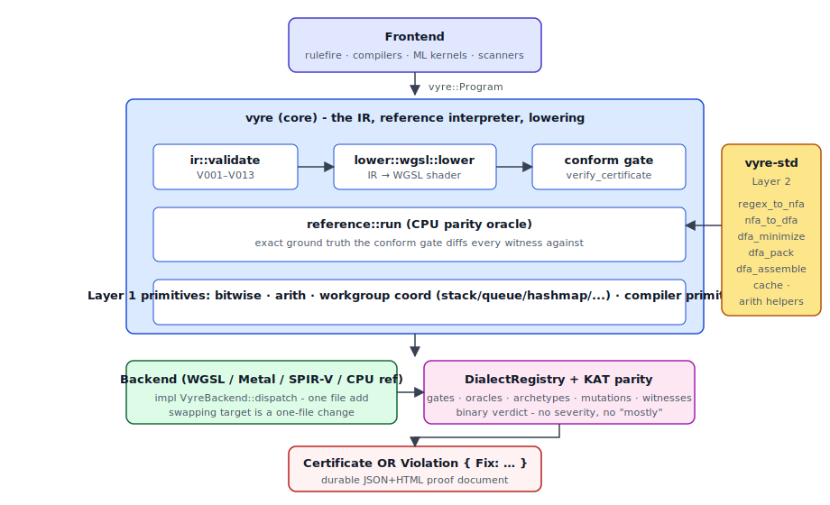

# vyre



**Vyre is the abstraction layer GPUs never got.**

CPUs evolved a natural stack of abstractions over fifty years. You write Python without knowing SIMD. You write C without knowing TLB shootdowns. You write a web server without knowing cache coherency protocols. Each layer genuinely forgets the one below it.

GPUs never got that stack. CUDA looks like C but leaks warps, divergence, shared memory banks, and barrier semantics everywhere. WGSL is slightly prettier assembly. Triton is tiled assembly. There is no layer where you can say "I need a stack" or "I need a hashmap" and the hardware details are genuinely hidden.

Vyre is that missing stratum. It provides workgroup-local stacks, queues, hashmaps, state machines, typed arenas, string interners, dominator trees, union-find structures, visitor walks, and fixed-point dataflow engines as first-class primitives. Each primitive lowers to the shader a hand-optimizer would write, and the conformance gate rejects any backend that diverges by even one bit.

For the `0.4.2` release, the public semantic unit is `vyre::Program`: condition evaluation, bytecode-compatible lowering, CUDA execution, and WGPU fallback evidence all bind back to that contract.

A Python developer uses `numpy.dot` without knowing SIMD. A vyre consumer calls `vyre::compile(program)` without knowing lowering, WGSL, GPU dispatch, or conformance. Each layer is sealed, composable, and never refactored. Adding capability is always additive: new file, new trait impl, new backend. Never modifying an existing frozen contract.

## The 10-second pitch

Every GPU framework handles the embarrassingly parallel case. That problem is solved. Vyre ships what nobody else does: compiler-grade sequential logic on GPU, with workgroup-local coordination and a machine-verified conformance gate. Think MLIR composability, plus property-based verification over bounded witness domains with counterexample extraction, plus SQLite engineering discipline.

Vyre unblocks the workloads every other GPU stack punts to CPU: lexers, parsers, borrow checkers, type solvers, regex engines, and fixed-point dataflow analyzers. You compose ops. Vyre parity tests prove that the backend reproduces the reference bit-for-bit.

Vyre is not another GPU IR competing with SPIR-V. SPIR-V is a compilation target. Vyre is a semantic contract system that compiles to SPIR-V, WGSL, Metal, or DXIL as a backend detail. Vyre is not an ML framework; ML kernels are one of the simpler things it expresses. Vyre is not a replacement for CUDA or wgpu; it is the layer above them that makes their hand-tuned code surface addressable from high-level IR without losing performance. Vyre is not a language; humans write Rust, and vyre absorbs the mechanical GPU-specific concerns.

Vyre must become the standard for expressing GPU computation. Not by decree, but by being so correct, so composable, and so well-tested that building a GPU project without vyre is obviously more expensive than building with it. The ecosystem compounds. Every contributed operation makes vyre more valuable. Every backend makes adoption easier. Every parity suite proves the ecosystem works. Forking is suicide; contributing is the only rational strategy.

## The vyre crates

| Crate | Purpose | Audience |
|-------|---------|----------|
| `vyre` | IR, ops, lowering, `VyreBackend` trait: the core compiler surface every consumer imports | end user |
| `vyre-spec` | Frozen data contracts (5-year SemVer): stable enum tags, wire constants, schema types shared across vyre crates | end user |
| `vyre-reference` | Pure-Rust CPU reference interpreter; the oracle every backend must match byte-for-byte | end user |
| `vyre-driver-cuda` | CUDA-backed GPU backend implementing the release fast path for NVIDIA systems | end user |
| `vyre-driver-wgpu` | wgpu-backed GPU backend implementing the portable fallback path | end user |
| `vyre-foundation` | IR, serialization, validation, transform, optimizer: the core compiler substrate | maintainer |
| `vyre-driver` | Backend traits (`VyreBackend`, `Executable`, `Compilable`), registry, routing, diagnostics | maintainer |
| `vyre-intrinsics` | Hardware-mapped intrinsic ops: subgroup, barrier, FMA, bit manipulation | end user |
| `vyre-runtime` | Persistent megakernel (GPU-as-bytecode-interpreter) + Linux `io_uring` zero-copy NVMe → GPU streaming | end user |
| `vyre-primitives` | Tier 2.5 LEGO substrate shared by multiple Tier-3 dialects | end user |
| `vyre-macros` | Proc-macro crate (`#[vyre_pass]`, registration helpers) used by `vyre` at compile time | maintainer |
| `vyre-driver-spirv` | SPIR-V emitter: reuses naga IR to emit SPIR-V for Vulkan-compute runners outside wgpu | end user |
| `vyre-libs` | Category A composition ecosystem: `math`, `nn`, `matching`, `hash`, `decode`, `parsing`, `security` modules as pure vyre IR over `vyre-intrinsics` + `vyre-primitives` (no shader source) | end user |
| `xtask` | Workspace task runner (release, publish, audit helpers) invoked via `cargo_full run --bin xtask -- ...` | maintainer |

## `0.4.2` release execution contract

The release route is explicit: `0.4.2` is a Vyre platform release, not a
production C compiler release.

| Package | Version | Role |
| --- | --- | --- |
| `vyre@0.4.2` | `0.4.2` | Public IR, lowering, optimizer, and backend trait surface |
| `vyre-driver-cuda@0.4.2` | `0.4.2` | NVIDIA/CUDA fast path for release workloads |
| `vyre-driver-wgpu@0.4.2` | `0.4.2` | Portable GPU fallback path for non-CUDA systems |
| `dataflow-integration@0.0.1` | `0.0.1` | Dataflow and witness primitives over Vyre IR |

`vyrec` and `vyre-frontend-c` are beta/active-development consumers of Vyre.
They are included to show the intended compiler-front-end direction, but they
are not the release gate for `0.4.2`, are not advertised as clang-parity, and
must not be treated as production-ready C compiler components until their own
corpus, parity, and performance gates are green.

CUDA is the preferred release backend when an NVIDIA GPU is present. WGPU is a GPU fallback backend, not a CPU fallback. A failed CUDA or WGPU probe on a machine that should have a GPU is a configuration error surfaced to the caller with remediation context; it is never silently converted into CPU execution.

The release gate ties this README to concrete evidence: backend metadata,
feature matrices, conformance reports, benchmark reports, and documentation
proof artifacts under `release/evidence/`. C parser corpus reports are tracked
as beta evidence for `vyrec`, not as a blocker for the Vyre platform release.

## The five-tier rule: where every op lives

vyre ops live at exactly one tier. The tier is encoded in the op ID
prefix and determines stability, size cap, and audit requirements.
Full rule in [`docs/library-tiers.md`](docs/library-tiers.md).

| Tier | Crate(s) | What lives here | Size cap |
| --- | --- | --- | --- |
| **1** | `vyre-foundation`, `vyre-spec`, `vyre-core` | IR model, wire format, frozen contracts. No ops. | - |
| **2** | `vyre-intrinsics` | Cat-C hardware-mapped intrinsics: ops that need a dedicated Naga emitter arm + dedicated `vyre-reference` eval arm (subgroup_*, barrier, fma, popcount, bit_reverse, inverse_sqrt). | frozen 9-op surface |
| **2.5** | `vyre-primitives` | Reusable LEGO substrate shared by multiple Tier-3 dialects: bitset, graph, reduce, predicate, fixpoint, text, matching, math, hash, parsing, nn. | Gate 1 budget |
| **3** | `vyre-libs` today; domain crates split only when they earn standalone ownership | Every product-facing `fn(...) -> Program` composition: math, hash, logical, nn, matching, rule, text, parsing, security. | no cap |
| **4** | External community crates | Tier-3-shaped packs outside the santht org, registered via `vyre-libs-extern` + `ExternDialect` | no cap |

**Op ID tells you the tier**: `vyre-intrinsics::hardware::fma_f32` is T2,
`vyre-primitives::graph::reachable` is T2.5, `vyre-libs::hash::fnv1a32`
is T3, `<community-dialect>::foo` is T4.

**Dependency direction is enforced**: T2 depends on T1 only;
T2.5 depends on T1 plus narrowly-approved intrinsics; T3 depends on
T2.5+T2+T1; T4 depends on T3+T2.5+T2+T1. Never upward. CI gate
`cargo_full run --bin xtask -- check-tier-deps` rejects violations.

**Region chain invariant**: every op at every tier wraps its body
in `Node::Region` and, when built from another registered op,
populates `source_region` so `cargo_full run --bin xtask -- print-composition <op_id>`
can walk the decomposition chain from public surface down to hardware
intrinsics. Spec in [`docs/region-chain.md`](docs/region-chain.md).

**Frontends stay outside core**. vyre is a GPU IR; source-language
frontends live in Tier-3 crates or downstream tools, generate grammar
tables / packed AST buffers, and feed GPU-side ops that walk those
buffers. Full spec + throughput math in
[`docs/parsing-and-frontends.md`](docs/parsing-and-frontends.md).

## How to navigate the docs

Every significant surface in vyre has a canonical doc. When onboarding:

| You want | Read this |
| --- | --- |
| Architecture and layering | `docs/ARCHITECTURE.md`, `docs/THESIS.md`, `docs/VISION.md` |
| **Which tier does my op belong to?** | `docs/library-tiers.md` |
| **Composition chain: how ops stay auditable** | `docs/region-chain.md` |
| **Source parsers: where frontends live** | `docs/parsing-and-frontends.md` + **`docs/PARSING_EXECUTION_PLAN.md`** (phases, tests) |
| Documentation precedence | `docs/DOCUMENTATION_GOVERNANCE.md` |
| Current release gate | `audits/RELEASE_GATE.md` |
| Historical plans | `docs/V7_RELEASE_PLAN.md`, `.internals/audits/from-docs-audits/MASTER_PLAN*.md` |
| **Ops catalog: full release surface** | `docs/ops-catalog.md` |
| **Santh-wide Cat‑A building blocks + testing program (roadmap)** | `docs/OP_MASTER_PLAN_BUILDING_BLOCKS_AND_QA.md` |
| **Execution status + op inventory refresh** | `docs/EXECUTION_STATUS.md`, `docs/generated/OP_INVENTORY.md` |
| Writing a new op (contract + review checklist) | `docs/library-tiers.md` + `docs/region-chain.md`: **no raw WGSL ever; the whole contract is here** |
| Wire format + release tag reservations | `docs/wire-format.md` |
| Backend contract (capability queries, lifecycle hooks, sealing) | `vyre-driver/BACKEND_CONTRACT.md` |
| OpDef field audit (primitive / hardware / composite / tensor-core) | `vyre-spec/OPDEF_CONTRACT.md` |
| Frozen trait surfaces (5-year SemVer) | `docs/frozen-traits/*.md` |
| Memory model + ordering | `docs/memory-model.md` |
| Error-code catalog (stable u32 ids) | `docs/error-codes.md` |
| SemVer + API-stability policy | `docs/semver-policy.md` |
| Observability (tracing spans + stats schema) | `docs/observability.md` |
| Security disclosure + threat model | `SECURITY.md` + `docs/threat-model.md` |
| Release playbook (publish order, alpha soak) | `docs/RELEASE.md` |
| Design RFCs (Region inline, autodiff, quantization, collectives, megakernel) | `docs/rfcs/000*.md` |
| Persistent megakernel + `io_uring` NVMe streaming (Linux) | `vyre-runtime/README.md` |
| Testing standard + 6 category skills | `.internals/skills/testing/SKILL.md` |
| Per-crate test contract | `<crate>/tests/SKILL.md` |
| In-flight release-bar gap contracts | `contracts/release.md` |
| Benchmark baselines | `benches/RESULTS.md` + `docs/BENCHMARKS.md` |
| Public-API snapshots (diff gate) | `<crate>/PUBLIC_API.md` |

## Try it in 2 minutes

```sh
cargo add vyre vyre-reference vyre-driver-cuda vyre-driver-wgpu
```

Build a program, serialize it to text, and run the reference interpreter:

```rust
use vyre::ir::{BufferDecl, DataType, Expr, Node, Program};
use vyre_reference::{run, value::Value};

fn main() -> Result<(), Box<dyn std::error::Error>> {
    // Construct an IR program that XORs two u32 buffers element-wise.
    let program = Program::wrapped(
        vec![
            BufferDecl::read("a", 0, DataType::U32),
            BufferDecl::read("b", 1, DataType::U32),
            BufferDecl::read_write("out", 2, DataType::U32),
        ],
        [1, 1, 1],
        vec![
            Node::let_bind("idx", Expr::u32(0)),
            Node::store(
                "out",
                Expr::var("idx"),
                Expr::bitxor(
                    Expr::load("a", Expr::var("idx")),
                    Expr::load("b", Expr::var("idx")),
                ),
            ),
        ],
    );

    println!("{}", program.to_text()?);

    let inputs = &[
        Value::Bytes(vec![0xAA, 0x00, 0x00, 0x00].into()),
        Value::Bytes(vec![0x55, 0x00, 0x00, 0x00].into()),
        Value::Bytes(vec![0x00; 4].into()),
    ];
    let outputs = run(&program, inputs)?;
    println!("output: {:?}", outputs);
    Ok(())
}
```

Run the same program on a GPU through an explicit backend. CUDA is the `0.4.2` release fast path on NVIDIA systems; WGPU remains the portable fallback:

```rust
use vyre::VyreBackend;
use vyre_driver_cuda::CudaBackend;

fn dispatch_cuda(program: &vyre::ir::Program) -> Result<(), Box<dyn std::error::Error>> {
    let backend = CudaBackend::acquire().map_err(|error| {
        std::io::Error::other(format!(
            "CUDA backend acquisition failed. Fix: inspect nvidia-smi, CUDA driver setup, and device capability reporting; do not treat this as a CPU fallback: {error}"
        ))
    })?;
    let inputs: Vec<Vec<u8>> = vec![
        vec![0xAA, 0x00, 0x00, 0x00],
        vec![0x55, 0x00, 0x00, 0x00],
        vec![0x00; 4],
    ];
    let outputs = backend
        .dispatch(program, &inputs, &Default::default())
        .map_err(|error| {
            std::io::Error::other(format!(
                "CUDA dispatch failed. Fix: inspect PTX lowering, launch bounds, and backend/device configuration: {error}"
            ))
        })?;
    println!("output: {:?}", outputs);
    Ok(())
}
```

Use `vyre-driver-wgpu` when CUDA is not the target backend:

```rust
use vyre::VyreBackend;
use vyre_driver_wgpu::WgpuBackend;

fn dispatch_wgpu(program: &vyre::ir::Program) -> Result<(), Box<dyn std::error::Error>> {
    let backend = pollster::block_on(WgpuBackend::acquire()).map_err(|error| {
        std::io::Error::other(format!(
            "WGPU backend acquisition failed. Fix: inspect adapter enumeration and driver setup; do not treat this as a CPU fallback: {error}"
        ))
    })?;
    let inputs: &[&[u8]] = &[
        &[0xAA, 0x00, 0x00, 0x00],
        &[0x55, 0x00, 0x00, 0x00],
        &[0x00; 4],
    ];
    let outputs = backend
        .dispatch_borrowed(program, inputs, &Default::default())
        .map_err(|error| {
            std::io::Error::other(format!(
                "WGPU dispatch failed. Fix: inspect backend/device configuration: {error}"
            ))
        })?;
    println!("output: {:?}", outputs);
    Ok(())
}
```

The wire format provides lossless binary transport: `program.to_wire()` serializes, `Program::from_wire()` reconstructs, and round-trip equality is invariant I4. The former general-purpose bytecode VM and NFA-scan micro-interpreter are absent from the `0.4.2` release line: every detection primitive (string scanning, taint flow, AST motif, decode chain, binary structural, neural suspicion filter, exploit-graph reconstruction, …) composes from vyre ops. No legacy host micro-interpreter remains in core; the resident megakernel is the GPU execution path. A downstream detection engine can compose scan, taint, decode, parse, fixpoint, graph, and neural stages in vyre IR. See [docs/ARCHITECTURE.md](docs/ARCHITECTURE.md) for architecture, [docs/wire-format.md](docs/wire-format.md) for the wire format, and [docs/inventory-contract.md](docs/inventory-contract.md) for the extension model.

## Standard library

The Layer 1 primitives live in `vyre` (core) and are organized into domains:

- **Primitive ops**: bitwise, arithmetic, and logical operations with exhaustive edge-case coverage and algebraic law verification.
- **Byte/text scan ops**: Aho–Corasick, substring find-all, multi-way scanners with real WGSL kernels (one ingredient inside larger programs).
- **Workgroup coordination primitives**: stack, FIFO queue, priority queue, hashmap, state machine, typed arena, string interner, visitor walk, recursive descent, dataflow fixed-point, dominator tree, and union-find.
- **Compiler primitives**: DFA engines, parser combinators, dataflow solvers, and tree-walk abstractions composed from workgroup primitives.

Composition-inlineable helpers live inside `vyre`'s own `ops::` tree alongside their primitives:

- **DFA/regex compilation pipeline**: `regex_to_nfa` (Thompson) → `nfa_to_dfa` (subset construction) → `dfa_minimize` (Hopcroft) → `dfa_pack` (Dense or EquivClass) → `dfa_assemble` (composite entry).
- **Aho-Corasick construction**: CPU reference + WGSL kernel + 5 GOLDEN samples + 20 KAT vectors.
- **Content-addressed compilation cache**: skips the pipeline when the same pattern set has already been compiled.
- **Arithmetic helpers**: ~80 typed compositional ops (saturating, wrapping, clamp, lerp, midpoint, abs_diff, div_ceil/round/floor).

## Benchmarks

The release benchmark story is compiler-grade macro workloads on CUDA, not primitive element-wise crossover tables. The current release evidence is `release/evidence/benchmarks/cuda-release-suite.json`: 13 macro workload families, RTX 5090, CUDA 12.8, at least 30 wall-time and CPU-baseline samples per artifact, zero failed cases, and a required CPU-SOTA 100x contract for every family.

| workload family | case | input floor | measured CUDA speedup vs CPU-SOTA |
|---|---|---:|---:|
| condition eval | `release.condition_eval.1m` | 12,582,916 bytes | 12,981.60x |
| string bitmap scatter | `release.string_bitmap_scatter.1m` | 8,388,612 bytes | 7,179.83x |
| offset count aggregation | `release.offset_count_aggregation.1m` | 12,582,916 bytes | 14,908.67x |
| metadata conditions | `conditions.yara_like.eval.1m` | 37,945,348 bytes | 1,537.90x |
| entropy window | `release.entropy_window.1m` | 12,582,916 bytes | 14,242.73x |
| quantified condition loops | `release.quantified_condition_loops.1m` | 12,582,916 bytes | 12,546.00x |
| alias reaching-def | `release.alias_reaching_def.1m` | 12,582,916 bytes | 14,302.58x |
| IFDS witness | `release.ifds_witness.1m` | 12,582,916 bytes | 14,181.72x |
| C AST traversal | `release.c_ast_traversal.1m` | 12,582,916 bytes | 4,378.81x |
| megakernel queued batches | `release.megakernel_queue.1m` | 12,582,916 bytes | 15,476.40x |
| e-graph saturation | `release.egraph_saturation.1m` | 12,582,916 bytes | 15,737.86x |
| sparse output compaction | `sparse.compaction.count.1m` | 4,194,308 bytes | 6,436.50x |
| callgraph reachability | `callgraph.reachability.step.262k` | 5,341,180 bytes | 208.84x |

Primitive element-wise measurements still exist as smoke and lower-bound telemetry in `benches/RESULTS.md`, but they are not the release claim. A release claim must point at compound parsing, dataflow, graph, rule-engine, megakernel, or optimizer workloads with GPU execution evidence and CPU-SOTA baselines.

Auto-registration is handled by link-time `inventory::submit!` registrations. Dialect operation files submit `OpDefRegistration` values, backend crates submit `BackendRegistration` values, and optimizer passes submit `PassRegistration` values. The registries are collected with `inventory::iter` at runtime and sorted where deterministic order matters. Adding a new dialect op, backend, or pass requires a new registration item, not a generated build-scan crate or a central hand-edited list.

Versioning follows the substrate pattern. `vyre-spec` publishes rarely and every release is an event: new data types, never removals, aggressive `#[non_exhaustive]`. `vyre` publishes patch releases frequently for optimizations and new lowerings. Backend crates publish on their own cadence after passing their parity suites. A community contributor can depend on `vyre-spec` alone without linking any backend.

## The Cat A / Cat B / Cat C discipline

Vyre organizes every operation into exactly one of three categories. This is not metadata decoration; it is an architectural gate that determines what code can exist and what code is forbidden.

**Category A: Pure composition.** A Cat A op is built entirely from existing ops. It introduces no new backend code, no new shader kernel, and no unsafe hardware assumption. Correctness propagates by construction: if the primitives are certified, the composition is certified. Most user programs and high-level library ops live here.

A new Cat A op ships as a focused builder under `vyre-libs/src/<domain>/`
or, when it becomes shared substrate, under `vyre-primitives/src/<domain>/`.
It introduces no backend-specific lowering and no hidden interpreter. The
filesystem is still the registry boundary: one domain, one responsibility,
and no central hand-edited list.

**Category B: Forbidden CPU coupling.** Cat B is the immune system's reject list. No general runtime interpretation engine, stack-machine evaluator, or host-dispatch substitute may exist in vyre. The `nfa_scan` micro-interpreter is absent from the `0.4.2` release line: those scans are expressed as composed ops in vyre IR and lower to GPU. Any construct that forces the host CPU to step into the execution loop of a GPU program is a Category B violation and is rewritten or deleted.

CI enforces this with tripwire gates that scan for forbidden patterns: `typetag`, `#[ctor]`, `Any::downcast`, dynamic async futures, pub-use globs, fake functions with `todo!()`, and frozen trait signature edits. These patterns break the black-box invariant, so their absence is load-bearing. `inventory::submit!` is the sanctioned link-time registration mechanism; it is not a runtime dispatch path. This keeps the abstraction stack sealed: GPU programs run on GPU, full stop. If a backend lacks a Category C hardware intrinsic, it returns `UnsupportedByBackend`; it never substitutes slow host execution. `vyre-reference` is a test oracle, not a runtime path.

**Category C: Hardware intrinsic with a contract.** A Cat C op declares a
dedicated backend lowering path, a pure-Rust reference oracle, a set of
algebraic laws, and engine invariants such as determinism, atomic
linearizability, barrier safety, and subnormal preservation. It has no
host substitute; unsupported hardware returns an error rather than silently
degrading the execution contract.

Every Cat C op must pass the parity gate before it ships. The gate runs exhaustive edge cases on the u8 domain, property-based witnesses on the u32 domain, adversarial mutations from the mutation catalog, and backend-oracle parity checks across archetypes. The algebraic laws include commutativity, associativity, identity, self-inverse, distributivity, DeMorgan, and op-specific identities. The engine invariants include deterministic output, atomic linearizability, workgroup invariance, subnormal preservation for strict ops, and declared ULP bounds for approximate float ops.

The zero-overhead claim is load-bearing. The benchmark track in `benches/vs_cpu_baseline.rs` compares vyre-dispatched primitives against a direct hand-written `wgpu` path and against CPU baselines on the same fixture. A Cat C op that loses to the hand-written path is a regression and is rejected. An op without a passing parity gate is a lie.

Determinism is achieved via restriction, not elimination. Strict IEEE 754 operations remain as two roundings; the backend cannot fuse them into FMA. Reductions are ordered sequentially or as a canonical binary tree. Subnormals are preserved for strict ops. Transcendentals such as `sin` and `cos` are approximate ops today: the reference path uses Rust `f32` math and the WGSL backend uses shader builtins, so their contract is a declared ULP tolerance rather than correctly rounded results. Approximate and strict never mix in the same certificate. You choose per operation, in the IR, visibly.

## Backend Parity

A backend passes only when it reproduces the reference bit-exactly across the entire op matrix, law suite, archetype corpus, adversarial mutation catalog, and enforcement gate battery. The gate battery includes:

- **Atomics safety**: every atomic operation is linearizable and race-free.
- **Barrier correctness**: control flow reconverges safely at every barrier.
- **Out-of-bounds detection**: buffer accesses stay within declared bounds.
- **Determinism enforcement**: identical inputs produce bit-identical outputs.
- **Wire-format validation**: round-trip serialization is lossless.
- **Architectural tripwires**: forbidden patterns are absent from the source tree.

A violation means the backend emitted a finding with an actionable fix hint that starts with `Fix: `. Every finding is critical; there is no severity field because at internet scale, a low-severity bug still corrupts billions of records.

The parity suite makes silent divergence structurally impossible. Green means conformant and shippable; red means stop and fix.

There are four contributor flows:

- Add a new op by copying the template and filling in the spec, laws, archetypes, and KAT vectors.
- Add a new gate by dropping a file in `enforce/gates/` with a `REGISTERED` const.
- Add a new oracle by dropping a file in `proof/oracles/` with a `REGISTERED` const.
- Add a new backend by implementing `VyreBackend` and running it through the parity suite.

Community knowledge that does not require Rust can be expressed as TOML rules. Drop a file in `rules/{category}/{name}.toml` and the tool auto-loads on the next scan. Every flow is additive. Nothing requires editing a central list. The architecture grows without refactoring.

## Who uses vyre

- **Downstream security tools.** Rule compilers lower detector DSLs into vyre programs and drive evaluation. Secret scanners run regex engines, entropy detectors, and hash verifiers on GPU. Reconnaissance scanners perform fingerprint matching, tech-stack detection, and DNS graph walks as workgroup-coordinated sequential logic. Every detector ships with a conform certificate.

Before vyre, these tools ran CPU-bound for the sequential parts of their pipelines. Every one of them was blocked by the same missing abstraction: workgroup-coordinated primitives without hand-written shader code. Vyre unblocks all of them simultaneously. Exhaustive text and binary scanning at internet scale becomes feasible because the primitives are proven correct and the backend is certified before deployment. A detector that passes `certify()` cannot silently produce the wrong answer on one vendor's driver while working on another.

- **Research compilers.** Teams building lexers, parsers, borrow checkers, and type solvers emit vyre IR instead of hand-writing WGSL. The compiler author never reasons about warps, thread IDs, barriers, or memory coherence; vyre's primitives absorb those concerns. The Rust lexer demo already carries workgroup-shaped token state through stack, interner, and arena primitives. The parser demo parses a Rust subset into a typed arena with recursive-descent and visitor-walk primitives.

A long-term milestone is a minimal Rust compiler expressed entirely as a vyre program: lexer, parser, resolver, trait solver, borrow checker, MIR builder, and codegen, all composed from vyre ops, all certified before execution. Not cross-compile. Not emit GPU backend code from CPU. The compiler author writes sequential logic; vyre absorbs every concurrency primitive they do not know how to reason about.

This keeps compiler workloads focused on IR semantics instead of GPU synchronization details.

- **GPU-first applications.** Any workload that needs zero-overhead abstraction on GPU with a machine-verified semantic contract. Video enhancement pipelines validate workgroup coordination at production scale. Scientific simulators rely on strict IEEE 754 determinism. Rule-evaluation engines lower to the same IR and run through the same gate, regardless of backend vendor.
If NVIDIA wanted to add a CUDA backend tomorrow, they could: an engineer reads the spec, implements one trait (`VyreBackend`), runs the conformance suite, gets a certificate. No communication with the vyre maintainers needed. If AMD wants to do the same independently, they can. Both backends produce identical bytes for every input, not because they coordinated, but because the spec is unambiguous and the conformance suite is the arbiter. The conformance suite is the arbiter: backend implementations must match the same byte-level contract.

## Contributing

Review boundaries are strict. Maintainers own law declarations, reference semantics, certificate format, and the gates. Contributors can propose changes there, but review will be stricter. Append-only paths such as corpora, regressions, and golden evidence should grow, not shrink. The project standard is simple: no fake implementations, no fake returns, no decorative laws, no swallowed errors, no dead code, and no contribution that only makes the suite quieter without making it truer.

## Links

- [Architecture](docs/ARCHITECTURE.md): workspace layout, frozen contracts, CI laws
- [Wire format](docs/wire-format.md): VIR0 binary serialization spec
- [Inventory contract](docs/inventory-contract.md): link-time registration and extension rules
- [Semver policy](docs/semver-policy.md): normative version contract
- [Error codes](docs/error-codes.md): canonical registry of stable diagnostic codes
- [Vision](VISION.md): the missing abstraction stack, After Effects architecture, network effects
- [Thesis](docs/THESIS.md): technical axioms and where vyre beats existing options
- [crates.io/crates/vyre](https://crates.io/crates/vyre)
- [github.com/santhsecurity/vyre](https://github.com/santhsecurity/vyre)
- [License: MIT](LICENSE-MIT) / [Apache-2.0](LICENSE-APACHE)

Parity is required before release.

## Release evidence anchors

- `release/evidence/version/version-matrix.json`
- `release/evidence/backends/backend-matrix.json`
- `release/evidence/benchmarks/release-workload-matrix.json`
- `release/evidence/conformance/conformance-matrix.json`
- `release/evidence/tests/test-matrix.json`
- `release/evidence/final/completion-audit.json`
